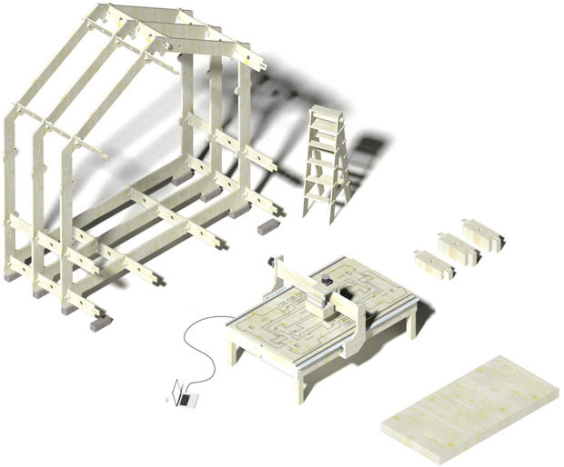
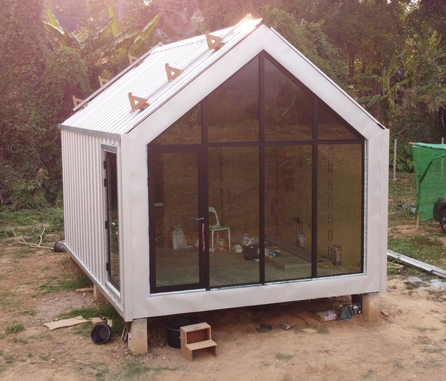

title:: 000: Wikihouse

- เราได้มีโอกาสได้เจอ [WikiHouse](https://wikihouse.cc) เมื่อปลายปี 2020 เป็นโครงการบ้าน opensource ที่ใช้ digital fabracation technology คือเปลี่ยนความคิดการสร้างบ้านไปเลย ด้วยการใช้แผ่นไม้อัดแผ่นขนาด 1.2x2.4m ตามทั่วไปมามาใช้ในการผลิตโครงสร้างบ้านทั้งหมดในการผลิต แทนงานคอนกรีต งานเหล็กที่ต้องใช้แรงงานความเฉพาะสูง ทีมงานในการก่อสร้าง และงบประมาณในการผลิตที่สูง
- 
- กรกฏาคม 2021 เราจึงได้ทำการทดลองเริ่มกระบวนการผลิต ด้วยการเริ่มต้นตั้งแต่สั่งเครื่อง CNC จากประเทศจีนเข้ามา ซึ่งเป็นชิ้นส่วนที่เราสามารถเปลี่ยนและดูแลได้เองในอนาคต ก่อสร้างโรงเก็บไม้อัด 300-400แผ่น เพื่อป้องกันความชื้น และจะได้ทะยอยผลิตชิ้นส่วนต่างๆได้
- 
- 
- เราพบว่าโครงสร้างบ้านที่ทำจากไม้อัดแข็งแรงมากจนน่าตกใจ ทั้งความง่ายในการผลิต ความรวดเร็วในการติดตั้ง การทำงานร่วมกับวัสดุในบริบทของประเทศไทย
- 
- 
- *สถานะโครงการ* ตอนนี้ อยู่ในช่วงสรุปผลวิเคราะห์ผลการก่อสร้าง มุมมองของช่างกับบริบทท้องถิ่นในไทย อย่างในพื้นที่ก่อสร้างของเราคือ ปาย แม่ฮ่องสอน ได้เจอปัญหาที่หลากหลายมากตั้งแต่อุณภหภูมิ การขนส่ง การแก้ปัญหาเฉพาะหน้าต่างๆ