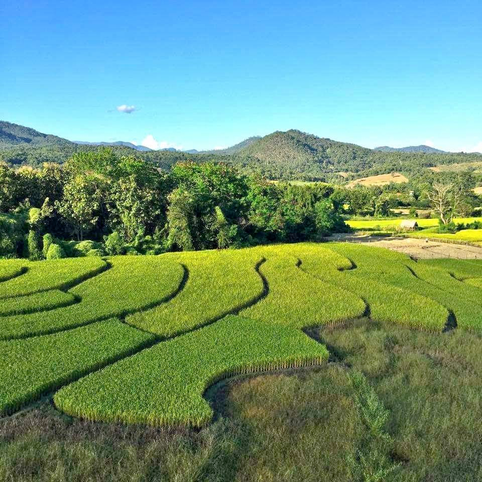

- 
- เราได้รับการสนันสนุนพื้นที่ขนาด 2 ไร่ ที่อำเภอปาย จังหวัดแม่ฮ่องสอน เพื่อทดลองสร้าง opensource space พื้นที่ทำงาน และชุมชน opensource ขนาดเล็ก ที่จะมี workshop พื้นที่สำหรับทำงาน พื้นที่อยู่อาศัย พื้นที่ผลิตเพาะปลูก ผลิตอาหาร เพื่อที่เราจะได้บันทึก และเผยแพร่สิ่งที่ได้เรียนรู้
